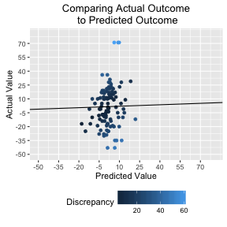
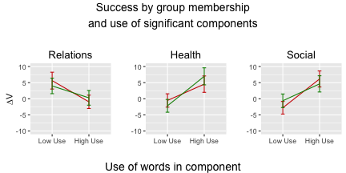
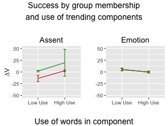

# Debate in the Wild: Multidimensional and Machine Learning Models

This R markdown provides the basis for our manuscript exploring the effects of linguistic behaviors on persuasiveness using <a href = "http://www.iq2us.org" target="_blank">the Intelligence Squared U.S.</a> corpus, first introduced by Paxton and Dale (2014, *Proceedings of the Cognitive Science Society*). This is the second of two R markdowns that accompanies this manuscript.

To run completely from scratch, you will need the following files:

* `./data/plotting-debate-data.csv`: The unstandardized dataset created in the `debate_in_the_wild-prep_summary_targeted.Rmd` file.
* `./supplementary/libraries_and_functions`: A source file that includes all necessary libraries and specifies new functions for the script.
* `./supplementary/dimensionality_cutoff-debate_in_the_wild.R`: A source file responsible for assisting in model selection.

**Code written by**: A. Paxton (University of California, Berkeley) and R. Dale (University of California, Merced)
<br>**Date last modified**: 23 June 2016

***

# Preliminaries

Let's prepare for our analyses.


```r
# clear workspace
rm(list=ls())

# set working directory and read in supplementary source file
setwd('/debate-in-the-wild/')
source('./supplementary/libraries-and-functions_debate-in-the-wild.r')

# load data and drop non-standard LIWC categories
classifier.data = read.csv('./data/plotting-debate-data.csv',
                           header = TRUE, sep = ",", row.names = NULL, fill = FALSE)
classifier.data = select(classifier.data,-one_of(unused.variables))
```

***

# Data preparation

***

## Isolate LIWC variables


```r
# list proportional LIWC main terms
liwc.main.prop = classifier.data %>%
  select(starts_with('prop')) %>%
  names(.)

# list proportional LIWC-by-group interaction terms
liwc.int.prop = classifier.data %>%
  select(starts_with('group')) %>%
  select(contains('prop')) %>%
  select(-one_of(debater.vars)) %>%
  names(.)

# list main and interaction proportional terms
liwc.both.prop = c(liwc.main.prop, 
                   liwc.int.prop, 
                   'group')
```

***

## Check debate data

Let's check that our data look like we expect them to.


```r
# check to make sure we have the correct data structure
dim(classifier.data) # (columns = features, rows = speakers)
```

```
## [1] 330 301
```

***

## Plot sample LIWC distribution

Let's look at the distribution of all LIWC features in the first debate, broken down by category. The plot below shows the usage of the 3 debaters from each side ("for" = green, "against" = red). The plot tracks which categories are used (by each debater) more than the mean proportion for that LIWC category across the entire dataset.


**Figure**: Speakers' use of words from all LIWC features across 'for'-group (green) and 'against'-group (red) debaters during the first debate. Each dot indicates that a given speaker's (x-axis) proportional use of the corresponding LIWC category (y-axis) -- across all of that speaker's turns -- exceeded mean (across the entire dataset) for that LIWC category.

***

# Data analysis: Classifiers with proportional LIWC data

***

## Subset data

Create the test and training subsets that we'll need. For replication, we rely on the test and training sets created in our initial analysis. 

The first snippet (which creates and saves the training and test sets) is by default set to `eval = FALSE`, but it can be changed if needed. The second snippet is set by default to run each time, reading in the CSVs for each dataset.


```r
# grab rows that will become part of the training and test sets
trainDebates = sample(1:dim(classifier.data)[1],
                      dim(classifier.data)[1]/1.5)
testDebates = setdiff(1:dim(classifier.data)[1],
                      trainDebates)

# create two separate subsets using those rows
trainSet = classifier.data[trainDebates,]
testSet = classifier.data[testDebates,]

# write them to CSV for replication
write.csv(trainSet,'./data/svm-training-set.csv', row.names = FALSE)
write.csv(testSet,'./data/svm-test-set.csv', row.names = FALSE)
```


```r
# read in training and test test from CSV
trainSet = read.csv('./data/svm-training-set.csv')
testSet = read.csv('./data/svm-test-set.csv')
```

***

## Run binary classifier for group identity

First, a classifier predicting group identity with only LIWC terms (i.e., proportional main terms only) is unable to reliably predict group membership.


```r
# can we use SVM to predict outcomes by the LIWC profile alone?
group.svm = svm(
  y = as.factor(trainSet$group),
  x = trainSet[names(trainSet) %in% liwc.main.prop],
  type = 'C-classification',
  kernel = "polynomial",
  cross = 10
)

# let's check out our results
group.svm.results = data.frame(table(
  predict(group.svm,
          testSet[names(trainSet) %in% liwc.main.prop]),
  testSet$group
))
names(group.svm.results) = c('pred','actual','freq')
group.svm.results
```

```
##   pred actual freq
## 1    1      1   31
## 2    2      1   23
## 3    1      2   39
## 4    2      2   17
```

```r
# let's find our true/false for/against
true.against = group.svm.results[group.svm.results$pred == 1 &
                                   group.svm.results$actual == 1,]$freq
true.for = group.svm.results[group.svm.results$pred == 2 &
                                   group.svm.results$actual == 2,]$freq
false.against = group.svm.results[group.svm.results$pred == 1 &
                                   group.svm.results$actual == 2,]$freq
false.for = group.svm.results[group.svm.results$pred == 2 &
                                   group.svm.results$actual == 1,]$freq

# accuracy
accuracy = (true.against + true.for) / sum(group.svm.results$freq)
accuracy
```

```
## [1] 0.4363636
```

```r
# sensitivity
sensitivity = true.against / (true.against + false.for)
sensitivity
```

```
## [1] 0.5740741
```

```r
# specificity
specificity = true.for / (true.for + false.against)
specificity
```

```
## [1] 0.3035714
```

***

## Run SVM for continuous outcome

Next, an outcome-based classifier that takes into account the proportional main LIWC terms, the group main term, and all LIWC-by-group interaction terms.


```r
# can we use SVM to predict continuous outcomes by the LIWC profile?
deltaV.both.svm.contin = svm(
  y = trainSet$deltaV,
  x = trainSet[names(trainSet) %in% liwc.both.prop], 
  type = 'eps-regression',
  kernel = "polynomial",
  cross = 10
  )

# create a data frame for the model results
contin.results = data.frame(table(
  predict((deltaV.both.svm.contin),
          testSet[names(trainSet) %in% liwc.both.prop]),
  testSet$deltaV))
names(contin.results) = c('pred.value', 'actual.value', 'freq')

# only grab the predicted values for each
contin.results = contin.results[contin.results$freq == 1,]
contin.results = select(contin.results,-freq)
rownames(contin.results) = seq(length=nrow(contin.results))

# convert factors to numbers
contin.results$pred.value = type.convert(as.character(contin.results$pred.value),
                                         dec = '.')
contin.results$actual.value = strtoi(contin.results$actual.value)

# let's see the results
contin.model.fit = lm(pred.value ~ actual.value, 
                      data = contin.results)
pander_lm(contin.model.fit,stats.caption = TRUE)
```


|       &nbsp;       |  Estimate  |  Std..Error  |  t.value  |  Pr...t..  |    p    |  sig  |
|:------------------:|:----------:|:------------:|:---------:|:----------:|:-------:|:-----:|
|  **(Intercept)**   |   1.533    |    0.5959    |   2.573   |  0.01143   | 0.01008 |   *   |
|  **actual.value**  |  0.05251   |   0.02756    |   1.905   |  0.05938   | 0.05672 |   .   |

Table: **Adjusted *R*-squared: 0.02; *F*(1,108) = 3.63**



**Figure**: The relation between the SVM's predicted debate outcomes and the actual debate outcomes.

***

# Data analysis: Classifiers with reduced-dimensionality data

Our previous analysis suggests that linguistic effects may be related to the debate outcomes. This section explores those effects by reducing the dimensionality of the data, allowing us to identify the linguistic threads that contribute to changes in debate outcome. Because many of the features are relatively sparse, we handle the data sparsity issue using SVD (singular value decomposition).

***

## Entropy transformation

First, let's do entropy transformation (see Landauer & Dumais; cf. *tf-idf*) of the main and interaction terms.


```r
# perform entropy transformation on our data
reduced.data = classifier.data %>%
  select(one_of(liwc.int.prop,
                liwc.main.prop,
                desc.variables)) %>%
  mutate_each( funs (./100 * (-log(mean(./ 100)))),
               -one_of(c('debate','speaker'))) %>%
  setNames(paste0('ent.', names(.)))

# rename the description variables
reduced.data = plyr::rename(reduced.data, 
                            c("ent.debate" = "debate",
                              "ent.speaker" = "speaker"))

# merge with existing dataset
reduced.data = join(classifier.data,reduced.data,
                    by=c("debate","speaker"))

# gather the new names of all entropy-transformed terms
liwc.prop.ent = reduced.data %>%
  select(starts_with('ent')) %>%
  names(.)
```

***

## Perform SVD

Next, we preform SVD over the entropy-transformed datasets for all main and interaction terms (`liwc.prop.ent`).


```r
res.ent = svd(reduced.data[names(reduced.data) 
                           %in% liwc.prop.ent])
```

***

## Identifying appropriate model structure

Here we identify the appropriate model structure for the SVM-based explorations of the data by balancing (1) the number of included components with (2) the gains in adjusted *R*-squared by adding those components.  We explore the potential gains made by including the 1st through 50th components when making this decision.


```r
# identify which group of data we're using
model.data = res.ent

# run models with 1-50 components
source('./supplementary/dimensionality_cutoff-debate_in_the_wild.R')

# which number of components saw the greatest gain over the previous model?
cutoff.selection = dim.cutoff.table[dim.cutoff.table$adj.r.gain ==
                                      max(dim.cutoff.table$adj.r.gain),]
chosen.cutoff = cutoff.selection$factor
print(chosen.cutoff)
```

```
## [1] 13
```


**Figure**: Gain in adjusted R-squared for each added component (top) and actual adjusted R-squared for each model (bottom). These were created by progressively calculating the adjusted R-squared for linear models predicting outcome (`deltaV`) with increasing numbers of components (i.e., `deltaV ~ c1`, `deltaV ~ c1 + c2`, ... `deltaV ~ c1 + c2 + ... + c50`).

***

## Predicting outcome with reduced-dimensionality LIWC data

Thanks to the previous section, we have now chosen to create a model predicting change in vote (`deltaV`) with the first 13 components of our reduced-dimensionality LIWC data. This section runs that model.


```r
# what components significantly predict deltaV?
deltaV.ent.lm.contin = lm(reduced.data$deltaV ~ res.ent$u[,1] +
                            res.ent$u[,2] +
                            res.ent$u[,3] +
                            res.ent$u[,4] +
                            res.ent$u[,5] +
                            res.ent$u[,6] +
                            res.ent$u[,7] +
                            res.ent$u[,8] +
                            res.ent$u[,9] +
                            res.ent$u[,10] +
                            res.ent$u[,11] +
                            res.ent$u[,12] +
                            res.ent$u[,13]
)

# let's check out the results
pander_lm(deltaV.ent.lm.contin,stats.caption = TRUE)
```


|        &nbsp;         |  Estimate  |  Std..Error  |  t.value  |  Pr...t..  |     p     |  sig  |
|:---------------------:|:----------:|:------------:|:---------:|:----------:|:---------:|:-----:|
|    **(Intercept)**    |   -103.9   |    68.66     |  -1.514   |   0.1311   |  0.1301   |       |
|  **res.ent$u[, 1]**   |   -1866    |     1208     |  -1.544   |   0.1235   |  0.1225   |       |
|  **res.ent$u[, 2]**   |   -469.9   |    304.4     |  -1.544   |   0.1237   |  0.1227   |       |
|  **res.ent$u[, 3]**   |   95.09    |    53.94     |   1.763   |  0.07888   |  0.07791  |   .   |
|  **res.ent$u[, 4]**   |  0.05592   |     38.6     | 0.001449  |   0.9988   |  0.9988   |       |
|  **res.ent$u[, 5]**   |   -36.38   |     20.5     |  -1.775   |   0.0769   |  0.07594  |   .   |
|  **res.ent$u[, 6]**   |   -51.89   |    19.79     |  -2.622   |  0.009172  | 0.008749  |  **   |
|  **res.ent$u[, 7]**   |   2.939    |    20.01     |  0.1469   |   0.8833   |  0.8832   |       |
|  **res.ent$u[, 8]**   |   83.33    |    20.07     |   4.153   | 4.225e-05  | 3.28e-05  |  ***  |
|  **res.ent$u[, 9]**   |   4.864    |     19.8     |  0.2457   |   0.8061   |  0.8059   |       |
|  **res.ent$u[, 10]**  |   8.327    |    20.65     |  0.4033   |   0.687    |  0.6867   |       |
|  **res.ent$u[, 11]**  |   -26.23   |    19.79     |  -1.325   |   0.1861   |  0.1851   |       |
|  **res.ent$u[, 12]**  |     24     |    20.13     |   1.192   |   0.2342   |  0.2333   |       |
|  **res.ent$u[, 13]**  |    101     |    20.53     |   4.921   | 1.392e-06  | 8.632e-07 |  ***  |

Table: **Adjusted *R*-squared: 0.13; *F*(13,316) = 4.86**

***

### Significant effects

Components 6, 8, and 13 all reached statistical significance in this model (*p* <= .05). The following sub-sections outline what each component captures.

Further interpretations of model results are explored in the "Discussion" section.


```r
significant.effects(deltaV.ent.lm.contin)
```


|    component    |     p     |
|:---------------:|:---------:|
| res.ent$u[, 6]  | 0.008749  |
| res.ent$u[, 8]  | 3.28e-05  |
| res.ent$u[, 13] | 8.632e-07 |

***
#### Component 6

Taken together, Component 6 appears to capture discussions about **relations**, including about time, people, and locations.


```r
# what are the highest 5 factors in component 6?
c6.high.factors = component.factors(reduced.data, res.ent,
                                    liwc.prop.ent, 6, "top")
pander(c6.high.factors, style = "rmarkdown")
```


|  component  |          name          |  weight  |
|:-----------:|:----------------------:|:--------:|
|     c6      | ent.group.prop.relativ |  0.4148  |
|     c6      |    ent.prop.relativ    |  0.2618  |
|     c6      |  ent.group.prop.space  |  0.2465  |
|     c6      |  ent.group.prop.ppron  |  0.2011  |
|     c6      |   ent.group.prop.we    |  0.1655  |

```r
# what are the lowest 5 factors in component 6?
c6.low.factors = component.factors(reduced.data, res.ent,
                                   liwc.prop.ent, 6, "bottom")
pander(c6.low.factors, style = "rmarkdown")
```


|  component  |          name          |  weight  |
|:-----------:|:----------------------:|:--------:|
|     c6      | ent.group.prop.Sixltr  | -0.2906  |
|     c6      |   ent.group.prop.bio   |  -0.239  |
|     c6      |    ent.prop.Sixltr     | -0.1833  |
|     c6      | ent.group.prop.health  | -0.1712  |
|     c6      | ent.group.prop.cogmech | -0.1521  |


***

#### Component 8

Component 8 can be labeled as **health**.


```r
# what are the highest 5 factors in component 8?
c8.high.factors = component.factors(reduced.data, res.ent,
                                    liwc.prop.ent, 8, "top")
pander(c8.high.factors, style = "rmarkdown")
```


|  component  |          name          |  weight  |
|:-----------:|:----------------------:|:--------:|
|     c8      |   ent.group.prop.bio   |  0.373   |
|     c8      | ent.group.prop.health  |   0.25   |
|     c8      |      ent.prop.bio      |  0.2299  |
|     c8      | ent.group.prop.relativ |  0.1873  |
|     c8      |    ent.prop.health     |  0.1541  |

```r
# what are the lowest 5 factors in component 8?
c8.low.factors = component.factors(reduced.data, res.ent,
                                   liwc.prop.ent, 8, "bottom")
pander(c8.low.factors, style = "rmarkdown")
```


|  component  |          name          |  weight  |
|:-----------:|:----------------------:|:--------:|
|     c8      |  ent.group.prop.work   | -0.3526  |
|     c8      | ent.group.prop.cogmech | -0.2276  |
|     c8      |     ent.prop.work      | -0.2145  |
|     c8      |  ent.group.prop.money  | -0.1894  |
|     c8      | ent.group.prop.affect  |  -0.175  |


***

#### Component 13

Finally, component 13 focuses on **social** dimensions.


```r
# what are the highest 5 factors in component 13?
c13.high.factors = component.factors(reduced.data, res.ent, 
                                     liwc.prop.ent, 13, "top")
pander(c13.high.factors, style = "rmarkdown")
```


|  component  |          name          |  weight  |
|:-----------:|:----------------------:|:--------:|
|     c13     | ent.group.prop.social  |  0.2207  |
|     c13     |   ent.group.prop.you   |  0.167   |
|     c13     |    ent.prop.social     |  0.1536  |
|     c13     | ent.group.prop.present |  0.1445  |
|     c13     |  ent.group.prop.time   |  0.1346  |

```r
# what are the lowest 5 factors in component 13?
c13.low.factors = component.factors(reduced.data, res.ent,
                                    liwc.prop.ent, 13, "bottom")
pander(c13.low.factors, style = "rmarkdown")
```


|  component  |          name          |  weight  |
|:-----------:|:----------------------:|:--------:|
|     c13     |  ent.group.prop.past   | -0.3019  |
|     c13     |  ent.group.prop.ipron  |  -0.241  |
|     c13     |  ent.group.prop.work   | -0.2346  |
|     c13     | ent.group.prop.pronoun | -0.2324  |
|     c13     |   ent.group.prop.bio   | -0.2177  |


***

### Trends toward significance

Our model shows that two components -- components 3 and 5 -- shows a trend toward significance (.05 < *p* <= .10).

Further interpretations of model results are explored in the "Discussion" section.


```r
trending.effects(deltaV.ent.lm.contin)
```


|   component    |    p    |
|:--------------:|:-------:|
| res.ent$u[, 3] | 0.07791 |
| res.ent$u[, 5] | 0.07594 |

***

#### Component 3

Component 3 is an **assent** category. The top components are main and interaction terms for the *assent* LIWC category (e.g., "yes") and the *Dic* LIWC category (i.e., whether the words in the turn are included in any of LIWC's categories).


```r
# what are the highest 5 factors in component 3?
c3.high.factors = component.factors(reduced.data,res.ent,
                                    liwc.prop.ent, 3, "top")
pander(c3.high.factors, style = "rmarkdown")
```


|  component  |         name          |  weight  |
|:-----------:|:---------------------:|:--------:|
|     c3      | ent.group.prop.assent |  0.819   |
|     c3      |    ent.prop.assent    |  0.4354  |
|     c3      |     ent.prop.Dic      |  0.1639  |
|     c3      |  ent.group.prop.Dic   |  0.1321  |
|     c3      |       ent.group       | 0.08941  |

```r
# what are the lowest 5 factors in component 3?
c3.low.factors = component.factors(reduced.data, res.ent,
                                   liwc.prop.ent, 3, "bottom")
pander(c3.low.factors, style = "rmarkdown")
```


|  component  |          name          |  weight  |
|:-----------:|:----------------------:|:--------:|
|     c3      |  ent.group.prop.funct  | -0.1971  |
|     c3      | ent.group.prop.cogmech | -0.07615 |
|     c3      | ent.group.prop.Sixltr  | -0.07477 |
|     c3      | ent.group.prop.pronoun |  -0.069  |
|     c3      |  ent.group.prop.verb   | -0.06882 |


***

#### Component 5

Component 5 revolves around **emotion** content.


```r
# what are the highest 5 factors in component 5?
c5.high.factors = component.factors(reduced.data,res.ent,
                                    liwc.prop.ent, 5, "top")
pander(c5.high.factors, style = "rmarkdown")
```


|  component  |          name          |  weight  |
|:-----------:|:----------------------:|:--------:|
|     c5      | ent.group.prop.negemo  |  0.2065  |
|     c5      | ent.group.prop.cogmech |  0.2012  |
|     c5      |  ent.group.prop.anger  |  0.1993  |
|     c5      | ent.group.prop.Sixltr  |  0.1705  |
|     c5      | ent.group.prop.affect  |  0.1513  |

```r
# what are the lowest 5 factors in component 5?
c5.low.factors = component.factors(reduced.data, res.ent,
                                   liwc.prop.ent, 5, "bottom")
pander(c5.low.factors, style = "rmarkdown")
```


|  component  |         name         |  weight  |
|:-----------:|:--------------------:|:--------:|
|     c5      | ent.group.prop.work  | -0.4508  |
|     c5      | ent.group.prop.money | -0.4191  |
|     c5      |    ent.prop.work     | -0.2851  |
|     c5      |    ent.prop.money    | -0.2732  |
|     c5      |  ent.group.prop.Dic  | -0.1704  |


***

# Discussion

These analyses explored how language use can affect opinion change in a real-world dataset with an objective outcome measure. While our more targeted analyses of a few language categories found no statistically significant effects on outcome, we did find several effects when leveraging the power of the larger-scale dataset.

When using the entire dataset -- including main terms of group and all LIWC variables, along with all group-by-LIWC interaction terms -- we found that an SVM regression was able to reliably predict debate outcomes (adjusted *R*-squared = .13). Next, we used a reduced-dimensionality dataset to identify which factors most contributed to winning outcomes.

The reduction of dimensions (using entropy transformations and singular value decomponsition) allowed us to explore how individual effects work together in concert. This prespective could capture the ways in which a constellation of individual effects -- which we were unable to capture in our predictions using single main and interaction terms -- might form larger-scale language dynamics that influence debate outcomes.

Below, we discuss each of the significant (**relations**, **health**, and **social**) and trending (**assent** and **emotion**) components in more detail.

***

## Summarizing the significant effects

Interestingly, although numerous group-by-LIWC interaction effects are included in each of the significant components, we find no significant interactions when we consider each component as a whole (**relations**, left; **health**, center; **social**, right).

For each of these components, we see a relatively uniform effect on outcome (`deltaV`), despite visual trends towards differences by group membership. For the relations component, we see a negative connection between increased use and "for" group gains (relative to "against" group gains). The health and social components demonstrate the opposite: Increased uses of these components is associated with greater "for" group gains.

It is important here to again note that these results are derived from nearly 70 debates with a range of topics. The centrality of these components to daily life -- relations, health, and social -- likely make them applicable to a range of arguments on both sides of any given debate.


**Figure**: Interactions for all significant components by group membership (green = 'for', red = 'against'). For ease of plotting, the scores for each component are split along the mean.

***

## Summarizing the trending effects

Increased use of the **emotion** component tends to be associated with a decrease in pre- to post-debate votes for the"for" group relative to the "against" group, with no differences by group membership. The **assent** component, by contrast, shows a trend toward the opposite.



**Figure**: Interactions for all trending components by group membership (green = 'for', red = 'against'). For ease of plotting, the scores for each component are split along the mean.
