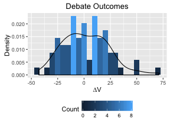

This R markdown provides the basis for our manuscript exploring the effects of linguistic behaviors and personal traits on persuasiveness using <a href = "http://www.iq2us.org" target="_blank">the Intelligence Squared U.S.</a> corpus, first introduced by Paxton and Dale (2014, *Proceedings of the Cognitive Science Society*). This is the first of two R markdowns that accompanies this manuscript.

To run completely from scratch, you will need the following files:

* `./data/all-debate-data.csv`
* `./supplementary/libraries-and-functions_debate-in-the-wild.R`
* `./supplementary/missing-data_debate-in-the-wild.R`

Additional files required for the data analysis will be generated at various steps throughout the code.

**NOTE**: The chunks of code in many sections need only be run once, since the manipulated data will be saved to new files. As a result, these chunks are currently set to `eval = FALSE`. Bear this in mind if these data need to be re-calculated.

**Code written by**: A. Paxton (University of California, Berkeley)
<br>**Date last modified**: 23 June 2016

*** 

# Global preliminaries

This section takes care of data import and preparation. As a new analysis of the IQ2 corpus (Paxton & Dale, 2014, *Proceedings of the Cognitive Science Society*), the original data file includes coded variables from prior work.

***

## Load libraries and functions

This section sets the working directory, loads in the requisite libraries, and creates new functions for the analyses.


```r
# clear up our workspace
rm(list=ls())

# set working directory for the first time
setwd('~/Dropbox/paxton/pubs/inprep-intellisquare')

# load in functions and libraries
source('./supplementary/libraries-and-functions_debate-in-the-wild.R')
```

***

# Data preparation

While we have the complete dataset including all debates, we still need to prepare the data a bit before we can analyze everything. This section takes the master dataframe and gets it ready for data analysis.

***

## Preparing debater-only subset

After having cleaned up the entire debate dataset, we here prepare the subset of data in which we're interested: turns at which only the debaters are speaking.

***

### Preliminaries


```r
# clean everything up
rm(list = ls())

# read in our source files
setwd('~/Dropbox/paxton/pubs/inprep-intellisquare')
source('./supplementary/libraries-and-functions_debate-in-the-wild.R')

# read in the concatenated dataset
debateList = read.csv('./data/all-debate-data.csv', header = TRUE, sep = ",", 
                      row.names = NULL, fill = FALSE)
```

***

### Winnow data and update NAs

This section removes turns by the moderator (`group` = `M`) and other speakers (`group` = `O`), then transforms missing data to `NA`.


```r
# keep only data where debaters are talking
debaters = debateList[debateList$group!='O',]
debaters = debaters[debaters$group!='M',]

# convert 909 (for photo ratings) and 999 (for in-depth voting details) to NA
debaters[debater.ratings][debaters[debater.ratings]==909] <- NA
debaters[detailed.variables][debaters[detailed.variables]==999] <- NA
```

***

### Recode groups and clean up

Let's create numeric codes for our debater groups ("against" = `1`, "for" = `2`), remove variables that were unavailable for all debates, and drop lines with missing data.


```r
# recode debater groups
debaters$group = as.numeric(debaters$group)

# remove the in-depth debate metrics
debaters = debaters[names(debaters) %notin% detailed.variables]

# drop any lines that have missing data
debaters = debaters[complete.cases(debaters),]
```

***

### Aggregate data at speaker level

Since the data were created in the B(eo)W(u)LF format (*by-word long-form*; Paxton & Dale, 2013, *arXiv*), the data are separated at the word level. We here aggregate data at the speaker level and export the data.


```r
# identify the LIWC variables
all.vars = names(debaters)
liwc.variables = all.vars[all.vars %notin% c(debater.ratings,
                                             desc.variables,
                                             text.variables,
                                             outcome.variables,
                                             summedLIWC.variables)]

# grab the outcome variables and debater ratings
outcome.data = debaters %>% 
  select(one_of(c(desc.variables,outcome.variables, debater.ratings))) %>%
  group_by(debate, group, speaker) %>%
  summarise_each( funs( mean ))

# create turn-level transcript
reconstituted.transcript = debaters %>% 
  group_by(debate, group, speaker) %>% 
  summarise(transcript = toString(word, sep=" ")) 

# aggregate base-100 LIWC variables
aggregated.liwc = debaters %>% 
  select(one_of(c(liwc.variables,desc.variables))) %>%
  group_by(debate, group, speaker) %>% 
  summarise_each( funs( sum(as.numeric(.))/100 ))

# sum the single-count variables
summed.liwc = debaters %>% 
  select(one_of(c(summedLIWC.variables,desc.variables))) %>%
  group_by(debate, group, speaker) %>% 
  summarise_each( funs( sum( as.numeric(.) )))

# bring together the individual dataframes
debaters = join(outcome.data, reconstituted.transcript,
                by = c('debate','group','speaker'))
debaters = join(debaters, summed.liwc, 
                by = c('debate','group','speaker'))
debaters = join(debaters, aggregated.liwc,
                by = c('debate','group','speaker'))
```

***

### Export aggregated speaker-level dataset

Let's save the speaker-level data to a CSV.


```r
# export the speaker-level data
write.csv(debaters, './data/speaker_level-debate-data.csv', row.names=FALSE)
```

***

## Standardize variables

In order to interpret the estimates of our forthcoming mixed-effects models as effect sizes (cf. Keith, 2008), we need to center and scale them before entering them into our model.

***

### Preliminaries

Let's clean up the workspace, read in the source file, and import the data.


```r
# clean everything up
rm(list = ls())

# read in our source files
setwd('~/Dropbox/paxton/pubs/inprep-intellisquare')
source('./supplementary/libraries-and-functions_debate-in-the-wild.R')

# read in the concatenated dataset
debaters = read.csv('./data/speaker_level-debate-data.csv', header = TRUE, sep = ",", 
                    row.names = NULL, fill = FALSE)
```

***

### Create proportion terms

Let's create new variables that treat our predictors as proportions of total words spoken by the speaker (`WC`). We also include the plural first-person pronoun category (`we`).


```r
# identify the LIWC variables
liwc.variables = names(debaters)[names(debaters) %notin% c(debater.ratings,
                                             desc.variables,
                                             text.variables,
                                             summedLIWC.variables,
                                             outcome.variables)]

# calculate variables as proportion of total words spoken by the speaker
proportion.vars = debaters %>%
  ungroup() %>%
  select(one_of(desc.variables,liwc.variables), WC) %>%
  mutate_each(funs( as.numeric(. / WC) ), -one_of(desc.variables, WC)) %>%
  select(-WC) %>%
  setNames(paste0('prop.', names(.)))
proportion.vars = plyr::rename(proportion.vars, 
                               c("prop.debate" = "debate",
                                 "prop.group" = "group",
                                 "prop.speaker" = "speaker"))

# merge with original dataset
debaters = join(debaters,proportion.vars,by=c(desc.variables))
```

***

### Create interaction terms

We here create standardized interaction terms that we can use for during the analysis stage in order to properly create models for both standardized and unstandardized models.


```r
# create interactions with group membership
group.interaction.vars = debaters %>%
  ungroup() %>%
  select(one_of(desc.variables,
                names(proportion.vars),
                liwc.variables,
                debater.ratings)) %>%
  mutate_each(funs( as.numeric(. * group) ), -one_of(desc.variables)) %>%
  setNames(paste0('group.', names(.)))
group.interaction.vars = plyr::rename(group.interaction.vars, 
                                      c("group.debate" = "debate",
                                        "group.group" = "group", 
                                        "group.speaker" = "speaker"))

# merge with existing dataset
debaters = join(debaters,group.interaction.vars,by=c(desc.variables))
```

***

### Standardize dataset

This step will create a centered and standardized dataset for our standardized models.


```r
# scale variables
debaters.st = debaters %>% ungroup() %>%
  mutate(speaker = as.integer(speaker)) %>%
  purrr::keep(is.numeric) %>%
  mutate_each( funs( as.numeric( scale(.) )))
```

***

### Save plotting and standardized datasets

We save separate versions of the new dataset, unstandardized (`./data/plotting-debate-data.csv`) and standardized (`./data/standardized-debate-data.csv`).


```r
write.csv(debaters, './data/plotting-debate-data.csv', row.names=FALSE)
write.csv(debaters.st, './data/standardized-debate-data.csv', row.names=FALSE)
```

***

# Data analysis

***

## Preliminaries

Let's clean everything up again and get ready for data analysis


```r
# clean everything up
rm(list = ls())

# read in our source files
setwd('~/Dropbox/paxton/pubs/inprep-intellisquare')
source('./supplementary/libraries-and-functions_debate-in-the-wild.R')

# read in the plotting and standardized datasets
debaters.plotting = read.csv('./data/plotting-debate-data.csv', header = TRUE, sep = ",", 
                             row.names = NULL, fill = FALSE)
debaters.st = read.csv('./data/standardized-debate-data.csv', header = TRUE, sep = ",", 
                       row.names = NULL, fill = FALSE)
```

***

## Some summary statistics

Let's take a peek at some of the attributes of the corpus before jumping in.

***

### How many debates do we have?


```r
# how many debates do we have?
total.debates = length(unique(debaters.plotting$debate))
total.debates
```

```
## [1] 69
```

***

### How many speakers are included?


```r
# how many unique speakers do we have?
total.speakers = length(unique(debaters.plotting$speaker))
total.speakers
```

```
## [1] 305
```

***

### How many words are included?


```r
# how many words do we have?
total.words = sum(debaters.plotting$WC)
print(total.words)
```

```
## [1] 908348
```

***

### How often does each team win?


```r
# get one line per debate
agg.data = debaters.plotting %>%
  select(debate,winner,deltaV) %>%
  group_by(debate,winner,deltaV) %>%
  summarise_each(funs(mean))

# what proportion of times does the "for" group win?
for.wins = sum(agg.data$winner)/length(agg.data$winner)
for.wins
```

```
## [1] 0.5072464
```

***

### What's the range of net gains for the "for" group relative to the "against" group?


```r
# what's the range of deltaV?
range.deltaV = range(agg.data$deltaV)
range.deltaV
```

```
## [1] -43  71
```



***

### What's the mean net gain for the "for" group relative to the "against" group?


```r
# what's the mean net gain for the "for" group (deltaV)?
mean.deltaV = mean(agg.data$deltaV)
mean.deltaV
```

```
## [1] 1.797101
```

***

## Differentiating between winning strategies


```r
# raw (unstandardized) model
deltaV.raw.lm = lmer(deltaV ~ group + prop.tentat + prop.we +
                           attractive + prop.negemo + 
                           group.prop.tentat + group.prop.we +
                           group.attractive + group.prop.negemo +
                           (1 + group + prop.tentat + attractive | winner),
                          data = debaters.plotting, REML = FALSE)

# standardized model
deltaV.st.lm = lmer(deltaV ~ group + prop.tentat + prop.we +
                           attractive + prop.negemo + 
                           group.prop.tentat + group.prop.we +
                           group.attractive + group.prop.negemo +
                           (1 + group + prop.tentat + attractive | winner),
                         data = debaters.st, REML = FALSE)

# raw (unstandardized) model results
pander_lme(deltaV.raw.lm, stats.caption = TRUE)
```


-----------------------------------------------------------------------
        &nbsp;           Estimate   Std..Error   t.value     p     sig 
----------------------- ---------- ------------ --------- ------- -----
    **(Intercept)**       -44.12      26.31      -1.677   0.0935    .  

       **group**          24.12       16.09       1.499    0.134       

    **prop.tentat**       252.2       522.9      0.4823   0.6296       

      **prop.we**         202.7       293.1      0.6916   0.4892       

    **attractive**        17.02       7.555       2.253   0.02426   *  

    **prop.negemo**        -394       333.9       -1.18   0.2381       

 **group.prop.tentat**    53.15       322.4      0.1649    0.869       

   **group.prop.we**      -302.6      189.6      -1.596   0.1105       

 **group.attractive**     -8.03       4.389       -1.83   0.0673    .  

 **group.prop.negemo**    80.57       203.6      0.3957   0.6923       
-----------------------------------------------------------------------

Table: **Marginal *R*-squared: 0.07; Conditional *R*-squared: 0.35.**

```r
# standardized model results
pander_lme(deltaV.st.lm, stats.caption = TRUE)
```


-----------------------------------------------------------------------
        &nbsp;           Estimate   Std..Error   t.value     p     sig 
----------------------- ---------- ------------ --------- ------- -----
    **(Intercept)**     -0.005681     0.3692    -0.01539  0.9877       

       **group**          0.5686      0.3794      1.499    0.134       

    **prop.tentat**      0.07293      0.1512     0.4823   0.6296       

      **prop.we**         0.101       0.146      0.6916   0.4892       

    **attractive**        0.3559      0.1579      2.253   0.02426   *  

    **prop.negemo**      -0.1797      0.1523      -1.18   0.2381       

 **group.prop.tentat**   0.03809      0.231      0.1649    0.869       

   **group.prop.we**     -0.2759      0.1729     -1.596   0.1105       

 **group.attractive**    -0.5652      0.3089      -1.83   0.0673    .  

 **group.prop.negemo**   0.07277      0.1839     0.3957   0.6923       
-----------------------------------------------------------------------

Table: **Marginal *R*-squared: 0.07; Conditional *R*-squared: 0.35.**


 


***

# Discussion

In addition to basic data preparation, this markdown explored how a series of targeted variables (drawn from work in linguistics, psychology, and political science) influence persuasion. We selected four linguistic behaviors and personal traits for each debater -- attractiveness, hedging, negativity, and pronouns -- and explored how these factors might influence persuasiveness during a live debate. Contrary to our expectations, we found only an effect of attractiveness on persuasion, in which greater attractiveness ratings were associated with higher "for"-group persuasiveness, *even if* the attractive debater were a member of the "against" group.

After investigating these targeted effects, our next R markdown leverages much broader linguistic measures in a series of exploratory models to better understand persuasiveness.
